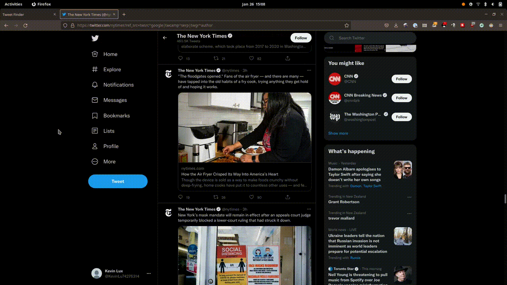

<h1>Tweetfinder</h1>

This Flask web app lets the user upload a screenshot of a tweet. The app will then use EasyOCR to gather all the text from the screenshot and use the Twitter API to search for the tweet. The Twitter API returns a collection of tweets. Every tweet is then assigned a score that factors in exact substring matches as well as approximate matches (using Levenshtein distance). Finally, the user is redirected to the URL of the best matching tweet.

I initially deployed this project on an Ubuntu server through Linode, but quickly found out that their free tier instance was just way too underpowered to run EasyOCR without constantly crashing. In the end I decided to take it down. But before I did that I took a screenrecording of it in action, which you can see below.

<h5>Screen recording</h5>

<h5>Code Walkthrough</h5>
And <a href="https://kevinluxdev.blogspot.com/2022/01/how-i-made-this-tweetfinderapp.html" target="_blank">here's</a> the link to the blog post

